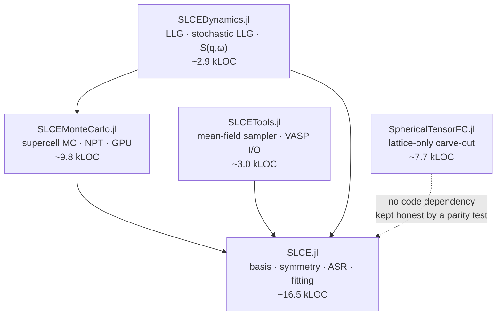
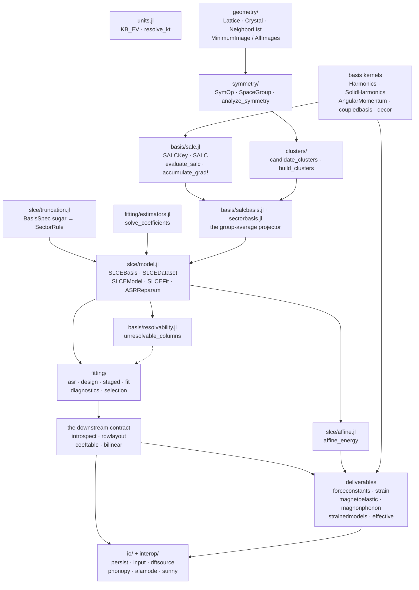
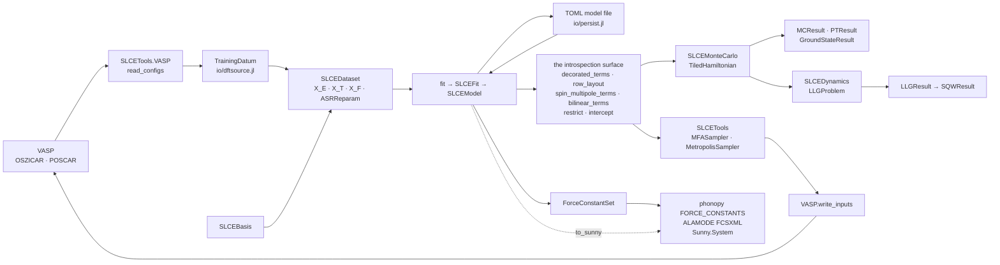

# Architecture and reading order — SLCE.jl

This file answers one question: **coming back to this code, what do I read, in what
order, and how do the pieces depend on each other?**

It is deliberately about *files and layers*. Three neighbours cover the rest and are
not duplicated here:

| For | Read |
|---|---|
| Why the design is the way it is (extension seams, oracle validation, the projection) | [`docs/src/theory/architecture.md`](docs/src/theory/architecture.md) and [`docs/design-notes.md`](docs/design-notes.md) |
| What the public API *is* (types, functions, realized features) | [`SPEC.md`](SPEC.md) |
| Which files must change together, and the gate that proves it | [`CLAUDE.md`](CLAUDE.md) § "Coupled code sites" |
| Naming | [`STYLE_GUIDE.md`](STYLE_GUIDE.md) |

---

## 1. Where this package sits



An arrow **A → B** reads "A depends on B". The graph is a strict DAG rooted here:
SLCE.jl depends on no other package in the family. `SphericalTensorFC.jl` is the
displacement-only carve-out and has **no code dependency in either direction** —
agreement is maintained out of process by its `test/slce_parity/` suite.

### Dependencies of this package

| Dependency | What it is for |
|---|---|
| `LegendrePolynomials` | `dnPl` in the tesseral-harmonic recursion (`basis/Harmonics.jl`) |
| `StatsAPI` | we *extend* `coef` / `fit` / `nobs` / `dof` / `coeftable` / `islinear` / `residuals` / `predict` / `r2` rather than shadow them |
| `TOML` | the persisted model format and the input-file reader |
| `Tables` | `SLCECoefficients` is a Tables.jl source |
| `StaticArrays`, `LinearAlgebra`, `Statistics`, `Random`, `Printf` | stdlib-level |

Everything heavy is a **weak** dependency behind a package extension:

| Extension | Weakdep | Lights up |
|---|---|---|
| `SLCESpglibExt` | `Spglib` | `analyze_symmetry(::SpglibBackend, ::Crystal)` |
| `SLCEGLMNetExt` | `GLMNet` | `solve_coefficients` for `Lasso` / `ElasticNet` / `AdaptiveLasso` |
| `SLCESunnyExt` | `Sunny` | `to_sunny(::SLCEModel)` |

The core therefore loads with no symmetry backend, no solver library and no spin
package, and `NoSymmetry()` + `OLS()` is a working baseline.

---

## 2. Internal layering

The include order in `src/SLCE.jl` is the ground truth:

```
units.jl
geometry/{lattice, crystal, neighborlist}.jl
symmetry/{types, backend}.jl
basis/{Harmonics, SolidHarmonics, AngularMomentum, coupledbasis, decor}.jl
clusters/{enumerate, orbits}.jl
basis/salc.jl · basis/salcbasis.jl
fitting/estimators.jl          # before model.jl
slce/truncation.jl             # before model.jl
io/provenance.jl               # before model.jl
slce/model.jl                  # ← the pipeline types
basis/sectorbasis.jl · basis/resolvability.jl
fitting/{asr, design, staged, fit, diagnostics, selection}.jl
slce/{coeftable, bilinear, introspect, rowlayout}.jl
slce/affine.jl · slce/forceconstants.jl · slce/strain.jl
slce/{magnetoelastic, magnonphonon, strainedmodels, effective}.jl
interop/sunny.jl
io/{persist, input, dftsource, embset, phonopy, alamode}.jl
```



### Include positions that are load-bearing

Moving any of these breaks the build, because a **signature annotation** is
evaluated when the method is defined:

1. `fitting/estimators.jl` **before** `slce/model.jl` — `SLCEFit` has a field
   `estimator::AbstractEstimator`.
2. `slce/truncation.jl` **before** `slce/model.jl` — `BasisSpec` has a field
   `sector_rules::Vector{SectorRule}`.
3. `io/provenance.jl` **before** `slce/model.jl` — `SLCEDataset` stores a
   `DatumProvenance`.
4. `basis/sectorbasis.jl` and `basis/resolvability.jl` **after** `slce/model.jl` —
   their methods annotate `::BasisSpec` / `::SLCEBasis`.
5. `slce/bilinear.jl` **before** `slce/introspect.jl` and `interop/sunny.jl` — both
   consume `_bilinear_terms`.
6. `slce/forceconstants.jl` **before** `slce/strain.jl`, `slce/magnonphonon.jl` and
   the two force-constant writers — they reuse `_fill_fcs_tensor!` verbatim and
   annotate `::ForceConstantSet`.
7. `slce/affine.jl` **before** `slce/strain.jl` — a homogeneous strain is not
   cell-periodic, so the strain path rides the affine evaluator.

### The one upward call, and why it is deliberate

`slce/model.jl` — the *type* layer — calls **up** into the fitting layer while
constructing a dataset: `build_asr` (`fitting/asr.jl`) and `_design_energy` /
`_design_torque` / `_design_force` (`fitting/design.jl`). This is legal because they
are *calls*, not annotations, and Julia resolves those at first invocation. It is
not an accident: the ASR reparameterization is built once per dataset and stored on
`dataset.asr`, so the type that stores it is the type that builds it.

---

## 3. Reading order

About three hours end to end. Everything else in the family assumes this package,
so it is worth doing first and doing once.

| # | File | What it establishes | The names everything downstream needs |
|---|---|---|---|
| 1 | `src/SLCE.jl` | The whole design in one module docstring, plus the `export` / `public` tiering that *is* the downstream contract | the two lists themselves |
| 2 | `src/geometry/neighborlist.jl` | Periodic resolvability — the Wigner–Seitz argument for what a finite cell can express at all. Read the header prose, not just the code | `MinimumImage`, `AllImages`, `build_neighbor_list` |
| 3 | `src/basis/decor.jl` | The channel vocabulary: a *site* carries factors, a *slot* is a tensor axis | `SiteFactor`, `SiteDecor`, `rep_scale` |
| 4 | `src/basis/salc.jl` | The data model **and** both evaluation kernels — the file the rest of the package is a client of | `SALCKey`, `Slot`, `evaluate_salc`, `accumulate_grad!`, `_canonicalize_members` |
| 5 | `src/basis/salcbasis.jl` | Where symmetry is imposed, how the gauge is fixed, why the orbit loop is thread-safe | `_project_and_fold`, `_canonical_basis`, `build_salc_basis` |
| 6 | `src/slce/truncation.jl` | How user sugar becomes the dense `SectorRule` rows everything downstream reads | `Sector`, `SectorRule`, `_resolve_sector` |
| 7 | `src/slce/model.jl` | The five pipeline types. **Read the inner constructors — they are the specification** | `SLCEBasis`, `SLCEDataset`, `SLCEModel`, `SLCEFit`, `ASRReparam` |
| 8 | `src/fitting/asr.jl` | Why translation invariance is a constraint on *coefficients* and not a projection; the β vs γ coordinate split | `build_asr`, `_asr_nullspace`, `_lift_gamma`, `asr_residual` |
| 9 | `src/fitting/fit.jl` | Centering and whitening, the three-block objective, the staged path, prediction | `_assemble_problem`, `fit`, `refit`, `predict_energy` |
| 10 | `src/slce/introspect.jl` + `src/slce/rowlayout.jl` | **The downstream contract** — the only surface SLCEMonteCarlo and SLCETools may read — and the `(4π)^(n_spin_slots/2)` scale rule | `DecoratedTerm`, `decorated_terms`, `restrict`, `_slot_scale`, `row_layout`, `site_rows!` |
| 11 | `src/slce/forceconstants.jl` | The exact-derivative deliverable and the Γ-point folding convention | `force_constants`, `_fill_fcs_tensor!`, `dynamical_matrix` |
| 12 | `src/slce/affine.jl` | The non-periodic evaluation path (strain, rotation), and why it is a *re-indexing* of the evaluator rather than a second one | `affine_energy`, `rotation_transfer_residual` |

### Safe to skip on a first pass

- `basis/Harmonics.jl`, `basis/SolidHarmonics.jl`, `basis/AngularMomentum.jl` —
  closed numeric submodules implementing published formulas. The one name that
  matters architecturally is `SolidHarmonics.solid_harmonic_poly`, the symbolic
  engine shared by the ASR builder, the force constants, the strain path and the
  effective model.
- `fitting/estimators.jl` — a menu of `solve_coefficients` methods over a plain
  `(X, y)`; no coupling to the basis machinery.
- `fitting/selection.jl` — the largest file in the package, and orthogonal to
  understanding the pipeline: GCV, the λ path, the Pareto rule, cross-validation.
- `slce/magnetoelastic.jl`, `slce/magnonphonon.jl`, `slce/strainedmodels.jl`,
  `slce/effective.jl` — leaf deliverables, each riding `forceconstants.jl` and
  `strain.jl`. Read one when you need it.
- `io/persist.jl`, `io/input.jl`, `io/embset.jl` — serialization.
- `io/phonopy.jl`, `io/alamode.jl` — format adapters encoding *external*
  conventions, defended by their own local-only test environments.
- `slce/coeftable.jl`, `slce/bilinear.jl`, `interop/sunny.jl`, `ext/*` — reporting
  and export surfaces.

---

## 4. Entry points and where the work happens

```
SLCEBasis(crystal, spec)                     slce/model.jl
 ├─ analyze_symmetry                         symmetry/backend.jl  (NoSymmetry)
 │                                           ext/SLCESpglibExt.jl (Spglib)
 │    └─ _assemble_spacegroup                symmetry/backend.jl
 ├─ build_neighbor_list                      geometry/neighborlist.jl
 ├─ build_clusters                           clusters/orbits.jl → candidate_clusters
 └─ build_salc_basis                         basis/salcbasis.jl   (plain)
                                             basis/sectorbasis.jl (sector table)
      ├─ _build_wig_cache                    serial, read-only — the thread-safety precondition
      └─ Threads.@threads over orbits → _orbit_salcs
           ├─ _project_and_fold → _canonical_basis     ← the gauge
           ├─ _transport_term
           └─ _canonicalize_members          basis/salc.jl
```

```
SLCEDataset(basis, data::Vector{TrainingDatum})   io/dftsource.jl
 ├─ _design_energy / _design_torque / _design_force    fitting/design.jl
 │        └─ accumulate_grad!                          basis/salc.jl
 └─ build_asr                                          fitting/asr.jl
      ├─ _asr_expansion → solid_harmonic_poly
      ├─ _prune_residue!
      └─ _asr_nullspace → ASRReparam                   slce/model.jl
```

```
fit(SLCEFit, dataset, estimator)             fitting/fit.jl
 ├─ _validate_fit_request / _resolve_asr_rep
 ├─ [staged] _fit_stage → sector_columns     fitting/staged.jl
 ├─ _assemble_problem                        centering + whitening, shared with refit
 ├─ solve_coefficients                       fitting/estimators.jl (or the GLMNet ext)
 ├─ _lift_gamma                              fitting/asr.jl — exact zeros, not the raw product
 └─ asr_residual
```

```
force_constants(model; spins, order)         slce/forceconstants.jl
 ├─ _warn_spin_blind / _warn_unresolvable    ← the two silent-wrongness guards
 │    └─ unresolvable_columns                basis/resolvability.jl
 └─ _accumulate_fcs! → _fill_fcs_tensor! → solid_harmonic_poly
dynamical_matrix(fcs, q)                     q in FRACTIONAL reciprocal coordinates

strain_derivatives(model; order)             slce/strain.jl
 ├─ _require_asr                             throws below 1e-12, deliberately
 ├─ _check_strain_origin                     order ≥ 2 measures origin independence
 └─ _accumulate_strain! → _fill_fcs_tensor!  the force-constant tensor, re-contracted
```

Other exported entry points, and the file that answers for them:

| Call | Lives in |
|---|---|
| `decorated_terms`, `spin_multipole_terms`, `restrict` | `slce/introspect.jl` |
| `row_layout`, `row_index`, `site_rows!` | `slce/rowlayout.jl` |
| `select_fit`, `select_support`, `cross_validate`, `gcv` | `fitting/selection.jl` |
| `identifiability`, `residuals_*`, `r2_*`, `rmse_*` | `fitting/diagnostics.jl` |
| `save`, `load` / `read_setup` | `io/persist.jl` / `io/input.jl` |
| `write_phonopy`, `write_alamode` | `io/phonopy.jl`, `io/alamode.jl` |
| `to_sunny` | `interop/sunny.jl` + `ext/SLCESunnyExt.jl` |
| `magnetoelastic_constants`, `magnon_phonon_vertices`, `effective_model`, `affine_energy` | the same-named files under `slce/` |

---

## 5. How the family fits together

This is the canonical cross-package map; the other four packages point here.



In prose:

- **DFT enters at exactly one seam**, `AbstractDFTSource` / `read_configs`
  (`io/dftsource.jl`). The concrete VASP adapter lives *downstream* in
  `SLCETools.VASP`, so this package stays DFT-code-agnostic. It produces
  `Vector{TrainingDatum}`; `SLCEDataset(basis, data)` turns those into the three
  design blocks plus the stored `ASRReparam`.
- **→ SLCEMonteCarlo** via `decorated_terms` / `spin_multipole_terms` /
  `row_layout` / `restrict` / `intercept`. The `(4π)^(n_spin_slots/2)` scale is read
  off `DecoratedTerm.scale` and applied **exactly once**, in the `TiledHamiltonian`
  constructor.
- **→ SLCEDynamics** via `SLCEMonteCarlo.TiledHamiltonian` and `energy_gradient!`,
  plus the shared vocabulary `MCView` / `Observable` / `Evaluable` / `LogBinner` /
  `philox_*` / `model_fingerprint` / `resume`.
- **→ SLCETools** via `spin_multipole_terms` / `bilinear_terms` / `Harmonics`. Its
  samplers produce configurations that loop back to DFT through
  `VASP.write_inputs` — the active-learning cycle.
- **→ external codes** via `ForceConstantSet` → `write_phonopy` / `write_alamode`,
  and via `to_sunny`.

Two family-wide invariants worth stating once:

- `KB_EV` and `resolve_kt` are defined **once**, in `src/units.jl`, and re-exported
  downstream. A second `const KB_EV` anywhere in the family is a defect.
- `n_atoms` and `has_disp` are **generics defined here and extended downstream**
  (`import SLCE: n_atoms`), never re-defined. A second generic of the same name
  compiles, passes both suites, and leaves a user who loads both packages with two
  functions that cannot both be called unqualified.
